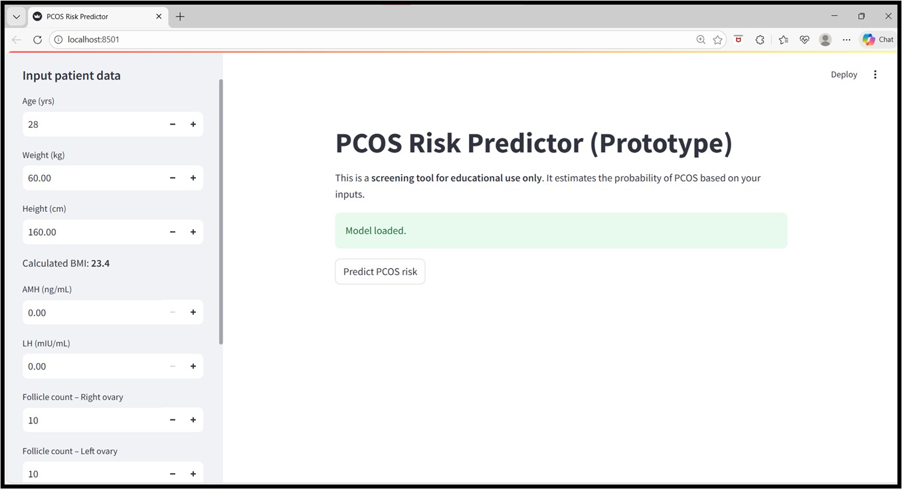
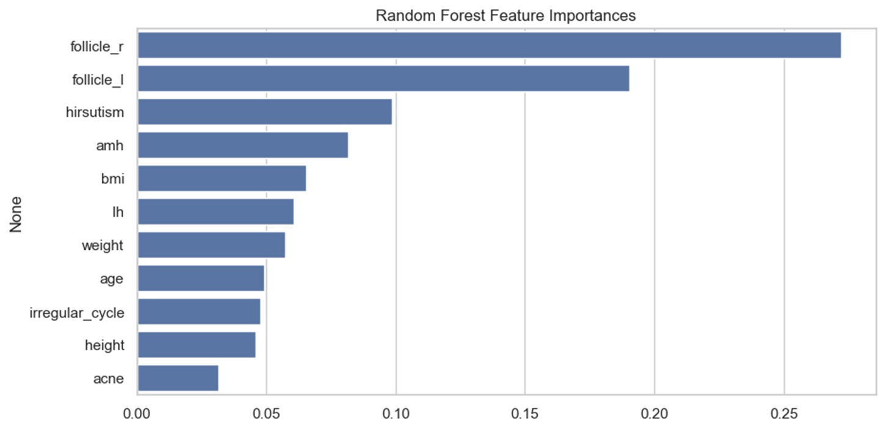

# PCOS Risk Prediction Using Machine Learning

A machine learning-based system for predicting the risk of Polycystic Ovary Syndrome (PCOS) using clinical, hormonal, and ultrasound-related features. The project compares multiple machine learning models and deploys the best-performing model through an interactive Streamlit web application.

## Overview

Polycystic Ovary Syndrome (PCOS) is a common hormonal disorder affecting women of reproductive age. Early detection can help reduce long-term complications such as infertility, diabetes, and metabolic disorders.

This project uses machine learning techniques to analyze patient data and estimate the likelihood of PCOS based on key clinical indicators.

## Features

- Data preprocessing and cleaning
- Exploratory Data Analysis (EDA)
- Feature selection
- Multiple ML model comparison
  - Logistic Regression
  - Support Vector Machine (SVM)
  - Random Forest
  - AdaBoost
- Feature importance analysis
- Streamlit web application for real-time predictions
- Model persistence using Joblib

## Project Structure

```text
PCOS/
│
├── app/
│   └── streamlit_app.py
│
├── data/
│   └── README.md
│
├── models/
│   └── pcos_model.joblib
│
├── notebooks/
│   ├── eda.ipynb
│   └── model_training.ipynb
│
├── src/
│   ├── preprocess_pcos.py
│   └── train_pcos.py
│
├── assets/
│   ├── app_preview.png
│   └── feature_importance.png
│
├── requirements.txt
├── README.md
└── LICENSE
```

## Dataset

The dataset contains clinical, hormonal, demographic, and ultrasound-based features including:

- Age
- Weight
- Height
- BMI
- AMH Levels
- LH Levels
- Follicle Count (Left & Right Ovary)
- Hirsutism
- Acne
- Menstrual Cycle Regularity

Dataset Source:
https://www.kaggle.com/prasoonkottarathil/polycystic-ovary-syndrome-pcos

*(Please download the dataset separately and place it in the data directory.)*

## Model Performance

| Model | Accuracy | F1 Score | AUC |
|---------|---------|---------|---------|
| Logistic Regression | 91.74% | 87.32% | 0.946 |
| Random Forest | 90.83% | 85.71% | 0.940 |
| AdaBoost | 89.91% | 84.51% | 0.941 |
| SVM (RBF) | 90.83% | 86.11% | 0.952 |

### Best Accuracy
**Logistic Regression**

### Best AUC
**Support Vector Machine (RBF)**

## Application Preview

### Streamlit Interface



### Feature Importance



## Installation

Clone the repository:

```bash
git clone https://github.com/Medha-Kauluri/PCOS-Risk-Prediction
cd PCOS-Risk-Prediction
```

Install dependencies:

```bash
pip install -r requirements.txt
```

## Training the Model

Preprocess the dataset:

```bash
python src/preprocess_pcos.py
```

Train the model:

```bash
python src/train_pcos.py
```

## Running the Application

```bash
streamlit run app/streamlit_app.py
```

The application will open in your browser and allow you to enter patient parameters to estimate PCOS risk.

## Technologies Used

- Python
- Pandas
- NumPy
- Scikit-Learn
- Matplotlib
- Seaborn
- Streamlit
- Joblib

## Important Note

This application is intended for educational and research purposes only. It is not a medical diagnostic tool and should not be used as a substitute for professional medical advice, diagnosis, or treatment.

## Future Improvements

- SHAP Explainability
- Hyperparameter Optimization
- XGBoost/CatBoost Models
- Deep Learning Models
- Cloud Deployment
- Mobile-Friendly Interface
- Integration with Healthcare Systems

## Author

**Medha Kauluri**

## License

This project is licensed under the MIT License.
